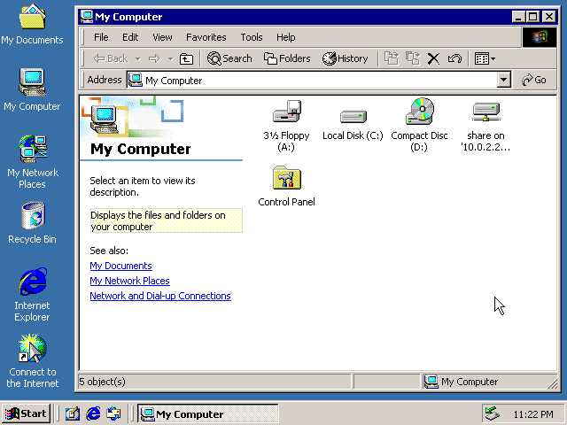

# Windows 2000 on Docker

A Docker image for Windows 2000 Advanced Server with SP4.



## Start an instance
```sh
docker run --detach \
  --name qemu-win2000 \
  --device /dev/kvm \
  --publish 127.0.0.1:3389:3389/tcp \
  --publish 127.0.0.1:5900:5900/tcp \
  --publish 127.0.0.1:6080:6080/tcp \
  docker.io/hectorm/qemu-win2000:latest
```

The instance can be accessed from:
 * **RDP** (`3389/TCP`), user `Administrator`, password `password`.
 * **VNC** (`5900/TCP`), without password.
 * **noVNC** (`6080/TCP`), http://127.0.0.1:6080/vnc.html
 * `docker exec -it qemu-win2000 vmshell`

Additionally the contents of the `/mnt/` directory in the container will be exposed on the `Z:` drive via SMB.

## Environment variables
#### `VM_CPU`
Number of cores the VM is permitted to use (`2` by default).

#### `VM_RAM`
Amount of memory the VM is permitted to use (`512M` by default).

#### `VM_KEYBOARD`
VM keyboard layout (`en-us` by default).

#### `VM_KVM`
Start QEMU in KVM mode (`true` by default).
> The `--device /dev/kvm` option is required for this variable to take effect.

## Why?
> "Your scientists were so preoccupied with whether or not they could, that they didn't stop to think if they should."
>
> Dr. Ian Malcolm

## Disclaimer
This project is not affiliated with and has not been approved by Microsoft.
The Windows 2000 Advanced Server disk image used in this demonstration has been obtained from [WinWorld](https://winworldpc.com/product/windows-nt-2000/final)
and it is published for digital preservation and demonstration purposes only.

## License
See the [license](LICENSE.md) file.
